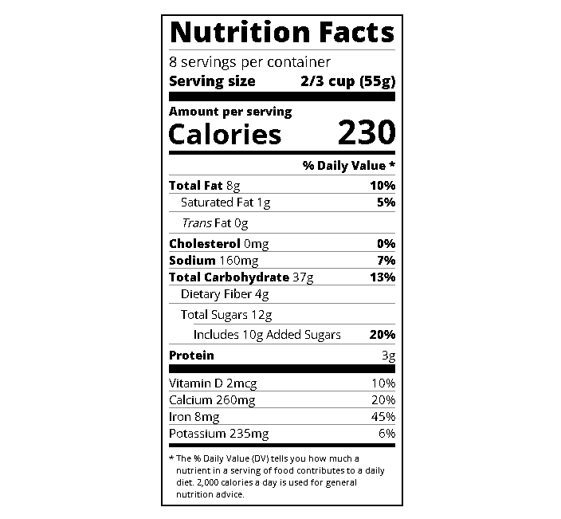

<h1>Nutrition Label</h1>
<h2>Nutrition Label made on FreeCodeCamp</h2>

In this course I better understood these concepts:

    <ul>
        <li>We use <b>box-sizing: border-box</b> because by default, the browser includes padding and margin when determining an element’s size;</li>
        <li>the <b>rem</b> unit stands for root em and it’s relative to the <b>font-size</b> in <b>html</b> element</li>
        <li>Pseudo element <b>:not</b> can be use to select items that do not apply to a certain rule;</li>
    </ul>
<h2>Preview</h2>
    
<h2>Conclusion</h2>
    
This course made me realize the importance of pseudo elements, I'll certainly lookup more about this subject because it makes things much easier. Another thing was the <b>border-box</b> value, I always used but never notice any difference, now I know why I should use it.

    
My current goal is to master React, but first I need to complete some begginer courses on FreeCodeCamp
